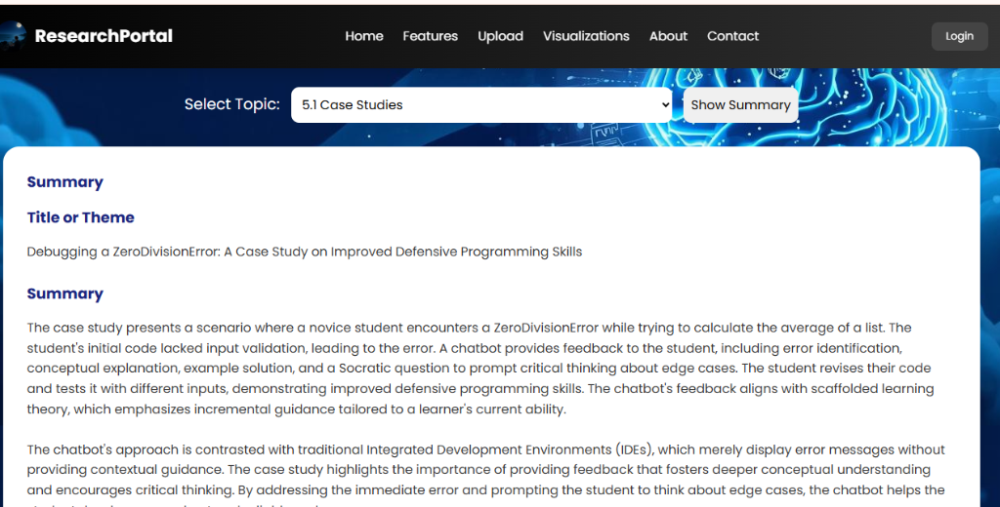
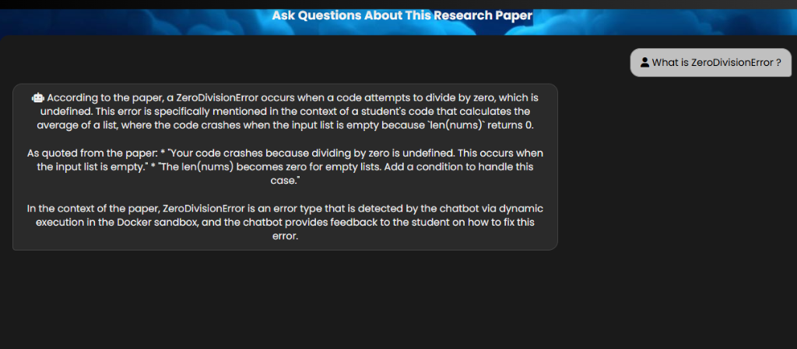

# 🔬 AI Research Paper Analyzer

<div align="center">


**Upload academic papers, extract key insights, and chat with your research using AI.**

[Features](#-features) • [Quick Start](#-quick-start) • [Deployment](#-free-deployment-options) • [API Reference](#-api-reference)

</div>

---

## 🤔 What is AI Research Paper Analyzer?

AI Research Paper Analyzer is an intelligent web application that helps researchers, students, and academics **understand complex research papers faster**. Instead of spending hours reading dense academic content, simply upload a PDF and let AI do the heavy lifting.

### The Problem It Solves

Reading research papers is time-consuming and challenging:
- 📚 Papers are often 50-100 pages long
- 🔬 Technical jargon makes understanding difficult
- ⏰ Finding specific information takes forever
- 🧠 Remembering key points across multiple papers is hard

### The Solution

This tool uses **Retrieval-Augmented Generation (RAG)** to:
1. **Extract** all text and sections from your PDF
2. **Understand** the paper using vector embeddings
3. **Summarize** any section in simple terms
4. **Answer questions** about the paper accurately

---

## 💡 What Can It Do?

| Capability | Description |
|------------|-------------|
| 📤 **Upload PDF** | Drag & drop any research paper (up to 16 MB) |
| 🗂️ **Auto-detect Sections** | Automatically finds Abstract, Introduction, Methods, Results, etc. |
| 📝 **Generate Summaries** | Get AI-powered summaries of any section in seconds |
| 💬 **Chat with Paper** | Ask questions like "What are the main findings?" or "Explain the methodology" |
| 🎯 **Smart Answers** | Prioritizes paper content, but falls back to general AI knowledge when needed |
| ⚡ **Fast Processing** | Powered by Groq's ultra-fast Llama 3.3 70B model |

### Example Questions You Can Ask:
- "What is the main contribution of this paper?"
- "Summarize the experimental results"
- "What datasets were used?"
- "Explain the proposed architecture in simple terms"
- "What are the limitations mentioned by the authors?"

### 📸 Screenshots

**AI-Powered Summary Generation:**



**Chat with Your Research Paper:**



---

## ✨ Features

| Feature | Description |
|---------|-------------|
| 📄 **PDF Analysis** | Upload research papers and automatically extract text and sections |
| 🧠 **AI Summarization** | Generate detailed summaries for any section using Llama 3.3 70B |
| 💬 **RAG Chat** | Ask questions about your paper with context-aware responses |
| 🧪 **Hybrid Knowledge** | If info isn't in the paper, AI provides general knowledge with clear distinction |
| 🔍 **Section Detection** | Automatically identify Abstract, Introduction, Methods, Results, etc. |
| ⚡ **Fast Embeddings** | HuggingFace sentence transformers for semantic search |
| 🔒 **Production-Ready** | Rate limiting, input validation, and XSS protection |

---

## 🚀 Quick Start

### Prerequisites

- Python 3.11+
- [Groq API Key](https://console.groq.com/) (free tier available)

### Installation

```bash
# Clone the repository
git clone https://github.com/moiz-mansoori/ai-research-paper-analyzer.git
cd ai-research-paper-analyzer

# Create virtual environment
python -m venv venv

# Activate virtual environment
# On Windows:
venv\Scripts\activate
# On Linux/Mac:
source venv/bin/activate

# Install dependencies
pip install -r requirements.txt
```

### Configuration

Create a `.env` file in the project root:

```env
GROQ_API_KEY=your_groq_api_key_here

# Optional: Cohere API for cloud embeddings (recommended for Render deployment)
# Get free API key at https://dashboard.cohere.com/api-keys
COHERE_API_KEY=your_cohere_api_key_here
```

> **Note:** If `COHERE_API_KEY` is not set, the app will use local HuggingFace embeddings (uses more RAM).

### Run Locally

```bash
python app.py
```

Visit **http://localhost:5000** in your browser.

---

## 🌐 Free Deployment Option.

<<<<<<< HEAD
### Render.com (Recommended) ⭐
=======
### Render.com ⭐
>>>>>>> 59991cb (docs: Add screenshots to README)

**Best for:** Easy deployment, auto-deploy from GitHub

| Feature | Details |
|---------|---------|
| **Free Tier** | 750 hours/month |
| **RAM** | 512 MB |
| **Sleep** | After 15 min inactivity |
| **Auto-deploy** | Yes, from GitHub |

**Steps:**
1. Push code to GitHub
2. Go to [render.com](https://render.com) → New → Web Service
3. Connect your GitHub repo
4. Set environment variables:
   - `GROQ_API_KEY` = your key
5. Deploy!

> ⚠️ **Note:** Free tier sleeps after 15 min. First request takes ~30-60s to wake.

<<<<<<< HEAD
---


=======
>>>>>>> 59991cb (docs: Add screenshots to README)
## 📖 API Reference

### Upload PDF
```http
POST /upload
Content-Type: multipart/form-data

file: <PDF file, max 16 MB>
```

**Response:**
```json
{"topics": ["Abstract", "Introduction", "Methodology", "Results"]}
```

### Get Summary
```http
POST /summary
Content-Type: application/json

{"topic": "Introduction"}
```

### Chat
```http
POST /chat
Content-Type: application/json

{"message": "What is the main contribution of this paper?"}
```

---

## 🏗️ Project Structure

```
ai-research-paper-analyzer/
├── app.py                    # Flask application
├── src/
│   ├── load_and_extract_text.py
│   ├── detect_and_split_sections.py
│   ├── get_summary.py
│   ├── create_vector_db.py
│   └── RAG_retrival_chain.py
├── templates/index.html
├── requirements.txt
├── Procfile                  # For Render/Heroku
├── render.yaml               # Render config
└── runtime.txt
```

---

## 🔧 Environment Variables

| Variable | Required | Default | Description |
|----------|----------|---------|-------------|
| `GROQ_API_KEY` | ✅ Yes | - | Your Groq API key |
| `COHERE_API_KEY` | ⭐ Recommended | - | Cohere API for cloud embeddings |
| `LLM_MODEL` | No | `llama-3.3-70b-versatile` | Groq model |
| `EMBEDDING_MODEL` | No | `all-MiniLM-L6-v2` | HuggingFace model (fallback) |

---

## 🛡️ Security

- ✅ Path traversal protection
- ✅ XSS prevention
- ✅ Rate limiting (30 req/min for chat)
- ✅ File size limits (16 MB)
- ✅ Session isolation

---

## 👤 Author

**Moiz Mansoori**

[](https://github.com/moiz-mansoori)
[](https://www.linkedin.com/in/moiz-mansoori03/)

---

<div align="center">

⭐ **Star this repo if you found it helpful!** ⭐

</div>
